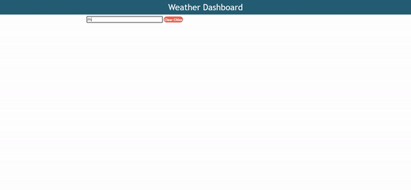

  <h1>Weather Dashboard </h1>
  
Weather Dashboard allows the user to get the current and 5-Day forecast for any location by typing in the city's name. Technologies uses: jQuery, Moment.js, and server-side APIs. 

     
  <h2>Table of Contents</h2>
  <ul> 
   <li><a href="#Installation">Installation</a></li> 
   <li><a href="#Usage">Usage</a></li>   
   <li><a href="#License">License</a></li>   
   <li><a href="#Contributing">Contributing</a></li>      
   <li><a href="#Questions">Questions</a></li>                         
  </ul>
  <h2 id="Installation">Installation</h2>                         
   Clone this repository: git clone https://denzgrant.github.io/Weather-Dashboard/
  <h2 id="Usage">Usage</h2>
  
This application is free to be used by anyone who also needs assistance with creating a professional README. 
 
  <h2 id="License">License</h2>
  
Licensed under the <a href="./License.txt">Unlicense</a>

  <h2 id="Contributing">Contributing</h2>
  
Anyone is free to contribute to this application. Being an open source community makes the Dev community special. Any contributes are appreciated. 

  

  <h2 id="Questions">Questions</h2>
  
Any questions regarding this project, contact denzgrant@gmail.com directly.
 
  
  
  
                             
  
